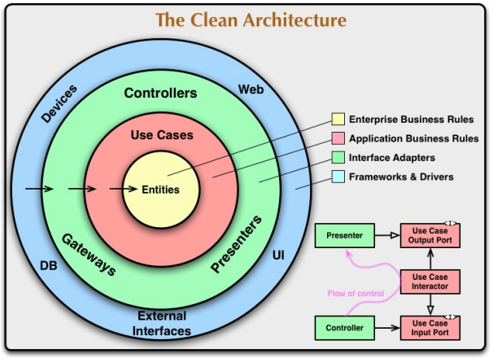

# How to Run the Application

To run the application, you need to have Docker and Docker Compose installed on your machine.
```bash
cd build
make up
```

## Running the Application with Only the PostgreSQL Container

If you want to run the application using only the PostgreSQL container:
1. Turn off the `slot-games.api` container.
2. In `conf/database.yaml`, change the `host` to `localhost` and comment out the line `"host: slot-games.postgres"`.
3. In `conf/http.yaml`, change the `host` to `localhost` and comment out the line `host: slot-games.api`.

Then, in the root of the project, run:
```bash
go run cmd/server/main.go
```

## Changing the Application Port

To change the application port, modify the `port` value in `conf/http.yaml`.

## Makefile Commands

In the Makefile, you can find additional commands to:
- Generate Swagger documentation.
- Run tests.
- Stop the containers.

---

# Architecture

For this exercise, I used a personal blueprint of clean architecture. This approach aligns well with **Domain-Driven Design (DDD)** principles, as it emphasizes the separation of concerns between different parts of the system. By separating core domain logic from infrastructure and application logic, this architecture allows developers to focus on the domain model and the business rules governing the system.
Similarly, this architecture adheres to **SOLID** principles by promoting loose coupling and high cohesion. By leveraging interfaces and dependency injection, it supports easy testing, modularity, and extensibility.



## Folder Structure

- **api**: The entry point of the application, where communication with the external world occurs.
- **build**: Contains the Docker Compose file to build the application.
- **conf**: Stores the application configuration files.
- **cmd**: Contains the `main.go` file to start the application.
- **migration**: Contains database migration files.
- **internal**: Contains the business logic of the application.

## Internal Folder Organization

The `internal` folder is divided by domains. The main domains of this app are **auth**, **user**, and **slot**:
- **auth**: Handles the application's authentication.
- **user**: Manages user-related information.
- **slot**: Manages user spin slot data.

Each domain is divided into four layers:
1. **domain**: Contains structs, interfaces, converters, and constants for the domain.
2. **model/usecase**: Contains the domain's business logic.
3. **repository**: Handles database connections and queries.
4. **controller**: Manages and sanitizes input and output data.

All the test was applied in the `model/usecase` layer. Because ideally, the business logic should be tested.

---

## Libraries Used

To enhance productivity and code quality, I used two libraries I created:
- [go-clean-arch-core-lib](https://github.com/guilhermealegre/go-clean-arch-core-lib)
- [go-clean-arch-infrastructure-lib](https://github.com/guilhermealegre/go-clean-arch-infrastructure-lib)

---

# Rate Limiter

Since there were no specific requirements for a rate limiter, I implemented the **Token Bucket algorithm** using Go's native library `golang.org/x/time/rate`.

While this rate limiter is simple and effective, it has limitations:
- It does not support data persistence.
- It cannot be used in distributed systems.

To address these limitations, a solution like Redis could be used for persistence and distributed functionality.

The rate limiter is implemented in the file `internal/middleware/spin_rate_limiter.go` and applied to the endpoint `api/v1/slot/spin`.

---
# API testing documentation
The API testing documentation is available through both Swagger and the Postman collection.

- The Postman collection can be found in the `/build` folder.
- The Swagger documentation is accessible at the endpoint:  
  `http://localhost:9000/api/v1/p/documentation/swagger`.

To retrieve the JSON document, you can use`http://localhost:9000/v1/p/documentation/swagger.json` or go to file 
```
cd /internal/swagger/docs/v1/swagger.json
```


#### Notes

1. I did not use UUID as the primary user identifier because I assumed this is not a distributed system, and the `user_id` is unique in the database.  
